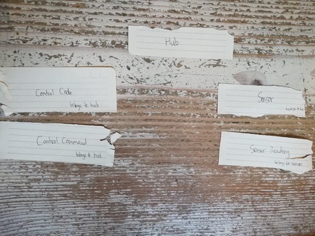
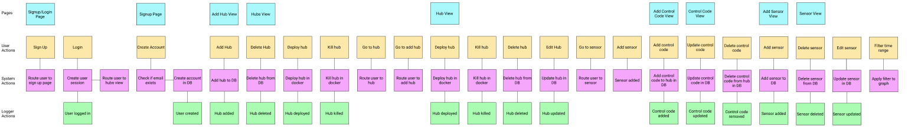
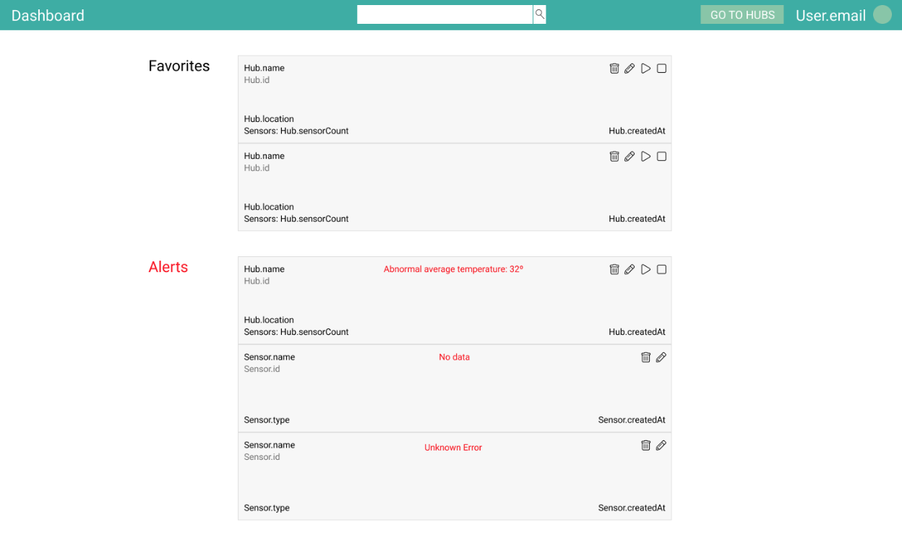
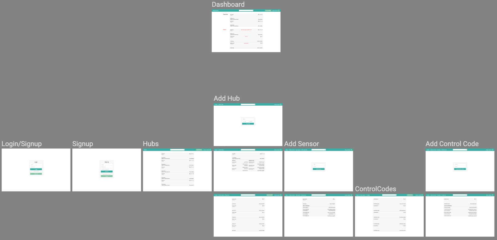

# Alice: Code as Design
##### An exploration into best practices for development of sustainable software systems.

## Introduction
To begin, my project focuses on broad problems present in software development and code design itself, as opposed to focusing on the function of the product. This project is concerned with the *how* and *why* much more than it is concerned with the *what*. I *am not* trying to develop the next best way to manage devices and data in automated farming systems. I *am* trying to explore code as design and demonstrate the power of code as design through the system I am implementing.

### Abstract
If code were written by computers, it could be arbitrarily complex. The code could represent something close to a dish of spaghetti, and as long as the computer understood how to read and write it, software development wouldn’t require much effort. The problem, however, is that humans are the primary writers, and readers, of original (not compiled) code. As Robert Martin stated in his book Clean Code: A Handbook of Agile Software Craftsmanship, “Indeed, the ratio of time spent reading versus writing is well over 10 to 1. We are constantly reading old code as part of the effort to write new code. ...[Therefore,] making it easy to read makes it easier to write” (Martin, R. C., Coplien, J. O., Wampler, K., et al, 2016). Since humans are not computers, and cannot handle anywhere near the level of complexity computers can, the software development process focuses on reducing complexity. Thus, measures which aim to reduce the complexity of a system’s codebase are worthwhile investments and are a core part of designing and building the system.

Considering this, Alice, a device management platform for industrial automated systems, is built with a focus on:
- extensibility
- simplified state management
- a strong separation of concerns

These principles improve development time and ease, enable me and outside developers to better improve the applications, and overall, lead to sustainable software systems: systems which support users and can be maintained effectively over time.

### Technical Overview
Alice is a device management platform for industrial systems such as farms, factories, and other automated systems. Specifically, Alice excels in managing sensor and control systems through the [web application](#appendix-c-user-interviews-research-and-testing)).

Picture an automated farm with a sensor network full of temperature, humidity, soil pH, and other sensors. This farm has hubs: central nodes which receive data from sensors, while also being able to execute codes to control systems such as a drip irrigation system. This would allow the hub to monitor sensor data, and react to it in real time by executing codes in order to modify the farm environment.

As an example, Entocycle, an insect farming company in London, is trying to optimize the size of black soldier fly larvae in a controlled environment. Currently, they manually collect data and adjust the temperature, humidity, and soil conditions; however, these changes are automatable. Alice would enable Entocycle to automate the data collection and control processes with the proper hardware and configuration.

Hubs would be stationed alongside clusters of black soldier fly larvae growing environments with sensors plugged into it. Upon receiving data from sensors, hubs would process the data, and then communicate with the central web server. The web server would then decide how to change the environment to optimize larvae growth, sending executable codes to the hubs to change the environment, completing the monitoring and control loop.

Altogether my project consists of a backend server specifications to fit the product needs, frontend implementations of the user experience, backend implementations of the API server, application deployment automation, and workflow/project management considerations. Alice is made up of a [backend API server](https://github.com/benjithedalilama/alice-backend), a Mongo database, and a frontend static build directory served up with a [web server](https://github.com/benjithedalilama/alice-frontend). A basic understanding of Javascript, HTML, CSS, React/Redux, Node.js, and other technologies mentioned in the paper is not necessary but will help the reader understand the examples; however, experience working with these technologies is preferred.

### Extensibility
At the core of software development is the extensibility of a codebase. Without the ability to change and update software easily, teams’ efforts to change software become extremely high friction and disastrous. Instead of precise and effective work that moves the application forward at the speed it needs to support growth and succeed, software development becomes akin to an unsuccessful firefighting effort, constantly putting out small fires without the time or resources to focus on the core structural problems.

As we add new features and build out a software application, our code needs to evolve to support the needs of our products and users. The more complex the codebase, the harder it is to extend, and the more unpredictable and harder to understand. Jeff Atwood writes that “the best code is no code at all” and that the real enemy is not code, it’s what you see in the mirror (Atwood, 2007). He says that we love to write code, too much, and “if [you] love writing code-- really, truly love to write code-- you'll love it enough to write as little of it as possible” (2007). Often times writing more code makes your system more complex, and harder to extend.

Thus, a large part of extensibility is separating systems by reducing dependencies, standardizing processes, and abstracting out functionality. All of which can be accomplished by using frameworks with agreed upon rules, sometimes enforced by the framework itself, tests written to monitor the behavior of specific pieces of the system, and other actions which will be demonstrated in this paper.

### Separation of Concerns
Feeding into extensibility is separation of concerns, which is the separation of functionality or ‘jobs’ that certain pieces of the software system are responsible for. Breaking up the responsibilities of the entire system into smaller bite-sized concerns isolates the tasks at hand to specific subsystems. This isolation and separation improves the maintenance process and makes the system more extensible because of the natural plug-and-play behavior which emerges. A good separation of concerns can be illustrated by different files calling the same service to execute the same function. For example, the [`hubService.js`](https://github.com/benjithedalilama/alice-frontend/blob/master/src/services/hubService.js) file in the frontend is concerned with making API calls specifically for the Hub-related API endpoints. Figure seven, shown later, illustrates how the HubService class is the sole piece responsible for fetching hubs and can be called anywhere in the frontend to do its job. This separation of concerns enables us to control how and where the user can interact with their hubs, and gives us tighter control over security and access to the API.

### Simplifying State Management
State management, simply defined as managing memory stored in an application, is one of the number one causes of pain and anguish for software developers; however, software developers can mitigate the complications associated with it by using frameworks that enforce rules, such as Redux. The Redux website explains clearly and concisely that “the whole state of your app is stored in an object tree inside a single store. The only way to change the state tree is to emit an action, an object describing what happened. To specify how the actions transform the state tree, you write pure reducers” (“Getting Started with Redux”, 2018). Redux simplifies the state management process by enforcing a directionality in the flow of data that affects the state.

Imagine a car with hundreds of moving parts that work together. The pieces depend on each other and work harmoniously to ultimately get someone from point A to point B moving metal at high speeds. There are rules and constraints to the system like gear ratios in the transmission, oil, cooling liquid to keep the engine cool enough, and an exhaust pipe to expel gas from the combustion reaction. Now imagine a software system that has hundreds of moving parts, but does not have constraints and rules surrounding the state of the system. A user clicks a button to logout and they get redirected to the login, but for some reason the system still thinks the user is logged in and it displays the logout button once again. After jumping down a three-hour rabbit hole investigating what could possibly be causing the problem, you realize the problem is in a completely different place and restart your work on the problem. Keeping with the engine analogy, imagine opening up the hood of a car, unscrewing and lifting multiple parts, popping out the engine, and finally getting to what you think is the problem, only to find out that you were looking in the wrong place.

This is the nightmare of state management, and has often been one of the hardest things about working with React specifically and other frameworks/systems. Redux, discussed later, imposes a strict set of rules on how the application state can be read and modified, simplifying state management.

## Frontend Implementation
### React
React, a Javascript-based client-side library, has a component-based architecture which lends itself to a system that has well-defined separations of concerns, great extensibility, and allows us to manage state in a standard way. React uses components which can modify the skeleton of a webpage, called the DOM (document object model). Each component is a JavaScript function that returns a piece of code that represents a piece of a web page (Domes, 2017). For example, the `Hub` component can both be used in the `HubView` component and the `HubListView` because the same basic component is present in both of those other components. The `Hub` component file is responsible solely for the `Hub` component, while the `HubView` is responsible for a specific display mode of the `Hub`. This architecture allows for developers to modify the `Hub` component without having to worry about changing the other components. This demonstrates the advantages of React: separation of concerns and extensibility is built into React with its component-based architecture.

#### React Components
I defined the components in my application for reusability and separation of concerns. Much like the `Hub` component, some of the components like the `List` component are meant to be extended into components like the `SensorList`, `CommandList`, and lists of other components that need customizable styling. Other components like the `ProfilePreview` and `Searchbar` are only called once in the code, but are created for modularity and future extensibility. Instead of housing a bunch of directives (`div`’s) in one JS file, I am able to ‘outsource’ the code into a React component and make the code cleaner, more modular, and ultimately easier to debug. Figures one and two below show the `ProfilePreview` component implementation and rendering. This example demonstrates that although components are meant to be reusable, they can still provide value even if they are only used once throughout the application. The tradeoffs between the time it takes to built an abstracted component, and the time saved by the component is important to consider, but sometimes building an abstract component is valuable just for the sake of modularity, separation of concerns, and future extensibility.

```javascript
import React from 'react'
import { connect } from 'react-redux'
import './profilepreview.css'

const ProfilePreview = props => (
  <div className={`${props.className} profilePreview`}>
    {props.children}
    <p className="profilePreview__text profilePreview__element">USER.EMAIL</p>
    
  </div>
)

export default connect()(ProfilePreview)
```
<span style="display:block" align="center">

Fig. 1: `ProfilePreview` component implementation

</span>

```html
<header>
  <div className="navbar">
    <div className="navbar__element navbar__breadcrumbs">
      <Breadcrumbs
        separator={<b> / </b>}
        item={BreadcrumbsLink}
        finalItem={'b'}
      />
    </div>
    <Searchbar className="navbar__element navbar__element--centered"></Searchbar>
    <ProfilePreview className="navbar__element">
    <Route exact path='/hubs' render={() => (<button onClick={() => this.props.changePage('/add-hub')} className="button button--alt profilePreview__element">ADD HUB</button>)}/>
    <Route exact path={['/hubs/:hubId', '/hubs/:hubId/sensors']} render={() => (<button onClick={() => this.props.changePage(`/hubs/${match.params.hubId}/add-sensor`)} className="button button--alt profilePreview__element">ADD SENSOR</button>)}/>
    <Route exact path={['/hubs/:hubId', '/hubs/:hubId/codes']} render={() => (<button onClick={() => this.props.changePage(`/hubs/${match.params.hubId}/add-code`)} className="button button--alt profilePreview__element">ADD CODE</button>)}/>
    </ProfilePreview>
  </div>
</header>
```
<span style="display:block" align="center">

Fig. 2: Header from `View` component implementation, renders `ProfilePreview` component

</span>

### Redux
By enforcing a central source of truth and standardizing the direction of data flowing through the application, Redux, a design pattern and library, simplifies the process of state management. State is handled with the Redux store, instead of in the specific components. The store provides a centralized state for the application that can only be updated by dispatching actions, which are then processed by reducers, functions which return a newly minted state, often based on which action they received.

Advantageously, React pairs well with Redux. React's component-based design pattern helps with state management because each component has the ability to dispatch actions which are processed by the root reducer and ultimately return a new application state. This means that I can manage the view dynamically across my entire application by dispatching actions within components, further separating concerns related to state management.

Actions are dispatched using Javascript in the React components themselves. The actions are received by reducers, explained later, which decide how to modify the store (the Redux centralized application state). For example, the `HubListView` loads in the hubs by dispatching an action that loads in the hubs by hitting an API endpoint. Figure three below shows this pattern in action.

```javascript
export class HubListView extends Component {
  componentDidMount() {
    this.props.dispatch(fetchHubs())
  }

  render() {
    const { hubs, filteredHubs } = this.props
    const displayedHubs = filteredHubs? filteredHubs : hubs

    return (
      <List>
        <BreadcrumbsItem to='/hubs'>Hubs</BreadcrumbsItem>
          {displayedHubs.map(hub =>
            <Hub hub={hub}>
              <Link className='list__text--main' to={{ pathname: `/hubs/${hub._id}`, hub: hub}}>{hub.name}</Link>
            </Hub>
          )}
      </List>
    )
  }
}
```
<span style="display:block" align="center">

Fig. 3: `HubListView` component dispatches an action to load the hubs after the component is mounted to the DOM (document object model)

</span>

Once the `fetchHubs` action is dispatched and received by the root reducer (a combination of all of the smaller reducers), our `hubs` and `filteredHubs` arrays are updated because the reducer returns a new state object including the modifications the action specified.

Now you may ask, wouldn’t we be able to manage the state and the view of a component without Redux? Doesn’t it complicate things? Yes and no. The regular React pattern requires less upfront resources, but long term Redux helps handle complexity much better. An example of the regular React pattern is shown in figure four below where the `handleChange` function updates the state when an input’s `value` changes.

```javascript
handleChange(e) {
    const { name, value } = e.target
    this.setState({ [name]: value })
}
```
<span style="display:block" align="center">

Fig. 4: The `handleChange` function

</span>

Component state is an object tree which defines how a component is rendered and behaves in your application, while application state is an overarching object tree which can be accessed from anywhere in the application. React provides us with a simple and straightforward approach to component state. However, we don’t have an easy process for our component to React to changes in application state, and we don’t want to unnecessarily use component state. We only want to use the component state for highly localized use cases, such as the `handleChange` function above, and not for application state. In a medium article, Micah Powell cleverly states: “If global state has to be reset when a component un-mounts, it probably should have been in the component state to begin with” (Powell, 2018). Powell is saying it is unnecessary to store application state if a page doesn't need the state to stay in memory when leaving or reloading the page. Concretely, our application as a whole does not care about the state of an input form or a menu being opened/closed, so we limit knowledge and memory to the component state. The state should be handled by the component, not by the Redux store because we don’t expect those properties to persist onto another page.

In summary, State management becomes increasingly complex as we add more moving parts to our application, and the standardized process Redux enforces allows us to keep track of actions that affect our application. This does not come without costs, of course. Often developers will rely too heavily on Redux, making the actions and reducers unnecessarily bloated and unmanageable (2018). There is also a balance between presentational and container components. Many components may not need to be aware of the global state Redux introduces, and wrongfully making them aware of the global state further complicates the software system and frontend state management. Taking this all into account, Redux is well worth the investment of time and energy if used thoughtfully and effectively to reduce the complexity of state management.

#### Redux Actions
Actions hold information about what happened, which allows us to handle the actions separately from where they were called, further improving separation of concerns and extensibility. If actions are written clearly and atomically they contribute to a more extensible application overall by allowing the ability to create, modify, or remove an action. With confidence, a developer trusts that the action is the only element of the application concerned with a certain function or role. To demonstrate, figure five below shows an action notifying Redux that hubs were successfully fetched (loaded). When `fetchHubsSuccess` is dispatched with a `hubs` parameter, Redux receives the action, and can modify the application state based on the type and payload of the action. If we wanted to extend this action to return a payload including a timestamp, we could easily add that as a parameter in both the action definition and where we dispatch the action if necessary. This behavior simplifies state management because the central store is being accessed in a regulated way, which can make it easier to understand the flow of data in the application.

```javascript
export const fetchHubsSuccess = hubs => ({
  type: FETCH_HUBS_SUCCESS,
  payload: { hubs }
})
```
<span style="display:block" align="center">

Fig. 5: `fetchHubsSuccess` action which returns a type and a payload of `hubs`

</span>

#### Redux Reducers
When actions are dispatched, reducers handle them, and return a newly minted application state. Reducers returning a new state, instead of modifying an existing state, helps simplify state management. Unexpected bugs can occur when mutating an existing state, so creating a new state every time a change needs to be made helps us reduce the occurrence of those bugs. To illustrate, figure six below shows the `hubReducer` which handles when the `fetchHubsSuccess` action is dispatched.

```javascript
export default function hubReducer(state = initialState, action) {
  switch(action.type) {
    ...
    case FETCH_HUBS_BEGIN:
      return {
        ...state,
        loading: true,
        error: null
      }

    case FETCH_HUBS_SUCCESS:
      return {
        ...state,
        loading: false,
        error: null,
        items: action.payload.hubs
      }

    case FETCH_HUBS_FAILURE:
      return {
        ...state,
        loading: false,
        error: action.payload.error,
        items: []
      }
    ...
```
<span style="display:block" align="center">

Fig. 6: `hubReducer` function that returns a new state

</span>

Upon receiving an action with the type of `FETCH_HUBS_SUCCESS`, the reducer returns a new state with the `action.payload.hubs` set as the value for the `items` key in the Redux store object tree. The `items` are later displayed in the `HubListView` component shown in figure three earlier. The enforced directionality of data flow paired with a centralized state and standardized data modification process (action, reducer, store) aids in separating concerns and improving the state management process.

### Services
I make use of services to separate API calls for loading in data from the server side. This improves extensibility and separation of concerns, ensuring there is only one place where those API endpoints are being called. This also improves reusability because we can call the services from anywhere in our application. Figure seven shows the `HubService.getAll` function being called, and figure eight shows what is going on under the hood.

```javascript
export const fetchHubs = () => {
  return async dispatch => {
    dispatch(fetchHubsBegin())

    try {
      const hubs = await HubService.getAll()
      dispatch(fetchHubsSuccess(hubs))
      return hubs
    }
    catch (err) {
      dispatch(fetchHubsFailure(err))
      handleErrors(err)
    }
  }
}
```
<span style="display:block" align="center">

Fig. 7: `fetchHubs` higher order action using the `HubService` class to get all hubs for a user

</span>

```javascript
class HubService {
  static async getAll() {
    try {
      const requestOptions = {
        method: 'GET',
        headers: authHeader(),
        credentials: 'include'
      }
      const response = await fetch(`${url}/users/${getCookie('userId')}/hubs`, requestOptions)
      const parsed = await response.json()
      return parsed.hubs
    }
    catch (err) {
      throw err
    }
  }
  ...
```
<span style="display:block" align="center">

Fig. 8: `HubService` class `getAll` method implementation. This function gets all hubs for a specific user from an API, and returns all of the hubs.

</span>

The service pattern separates the concerns related to authentication and client-side API calls, making sure that the HubService is the only Javascript file which can interact with this piece of the system. This makes it easier to maintain and extend, improves security, and reduces dependencies within our application because of the plug and play nature of services.

### CSS Styling
For CSS styling, I followed the [BEM](http://getbem.com/) (block, element, modifier) pattern which helps set a strict pattern on CSS formatting and naming conventions, and if used correctly in an organization, leads to extensibility improvements. Additionally, the CSS classes are highly reusable throughout the application. Below figure nine shows the Login component which uses BEM-based classes for forms and their different components.

```html
<div className="form__container">
  <div className="form">
    <form className="form__form" onSubmit={e => this.handleSubmit(e)} name="form">
      {this.props.error && <span className="form__text form__text--error">{this.props.error.message}</span>}
      <input className="form__input form__element" type="text" name="username" value={username} onChange={e => this.handleChange(e)} placeholder="Username"></input>
      <input className="form__input form__element" type="password" name="password" value={password} onChange={e => this.handleChange(e)} placeholder="Password"></input>
      <button className="button button--main form__element">Login</button>
      <p className="form__text">Forgot password?</p>
      <button className="button button--alt form__element" onClick={e => this.changePage('/signup')}>Sign Up</button>
    </form>
  </div>
</div>
```
<span style="display:block" align="center">

Fig. 9: BEM classes being used in the `Login` view

</span>

The `form__container`, `form`, `form__form`, `form__text`, and other form-related classes can be reused, such as in the `AddCodeView` component and `Signup` components seen below in figures ten and eleven respectively.

```html
<div className="form__container">
  <BreadcrumbsItem to={`/hubs`}>Hubs</BreadcrumbsItem>
  <BreadcrumbsItem to={`/hubs/${this.props.match.params.hubId}`}>{this.props.match.params.hubId}</BreadcrumbsItem>
  <BreadcrumbsItem to={`/hubs/${this.props.match.params.hubId}/add-code`}>Add Code</BreadcrumbsItem>
  <div className="form">
    <form className="form__form" onSubmit={(e) => this.handleSubmit(e)} name="form">
      {this.props.error && <span className="form__text form__text--error">{this.props.error.message}</span>}
      <input className="form__input form__element" name="name" value={name} onChange={e => this.handleChange(e)} placeholder="Name"></input>
      <input className="form__input form__element" name="action" value={action} onChange={e => this.handleChange(e)} placeholder="Action"></input>
      <button className="button button--alt form__element">Add Code</button>
    </form>
  </div>
</div>
```
<span style="display:block" align="center">

Fig. 10: The `AddCodeView` component employs the use of form-related BEM classes

</span>

```html
<div className="form__container">
  <div className="form">
    <form className="form__form" onSubmit={e => this.handleSubmit(e)} name="form">
      {this.props.error && <span className="form__text form__text--error">{this.props.error.message}</span>}
      <input className="form__input form__element" type="text" name="username" value={username} onChange={e => this.handleChange(e)} placeholder="Username"></input>
      <input className="form__input form__element" type="password" name="password" value={password} onChange={e => this.handleChange(e)} placeholder="Password"></input>
      <input className="form__input form__element" type="password" name="confirmPassword" value={confirmPassword} onChange={e => this.handleChange(e)} placeholder="Confirm Password"></input>
      <button className="button button--main form__element">Sign Up</button>
      <p className="form__text">Already have an account?</p>
      <button onClick={() => this.changePage('/login')} className="button button--alt form__element">Login</button>
    </form>
  </div>
</div>
```
<span style="display:block" align="center">

Fig. 11: Similarly the `Signup` component makes use of these classes

</span>

The BEM pattern takes no extra memory as it is not a library, its simply a naming convention. The main drawback of the BEM pattern is that it is not enforceable without using external tools like a [BEM linter](https://github.com/postcss/postcss-bem-linter). Thus, it relies on people in the organization to educate new team members and facilitate the use of the pattern, otherwise there will be a mess of non-BEM and BEM CSS. When shared and used properly, the BEM pattern provides reusability and a standard rule set that can be followed by a software team, improving extensibility.

### Tests
Testing is an important part of any application, and depending on how they are written, tests can bring attention to unexpected behaviors or broken features in your application. Figure twelve shows a test for the `userReducer` function that tests the reducer for specific behavior when the reducer receive an undefined `state` parameter.

```javascript
describe('user reducer', () => {
  it('should return the initial state', () => {
    expect(reducer(undefined, {})).toEqual(
      {
        user: null,
        loading: false,
        loggedIn: false,
        error: null
      })
  })
  ...
```
<span style="display:block" align="center">

Fig. 12: Tests if the reducer returns the initial state when given an `undefined` state.

</span>

We need an initial state so actions be consequential, otherwise we wouldn't have a user, loading, loggedIn, or error key in the Redux store, and thus, we wouldn't have dynamic data to display in our application. Our test helps us verify that we are setting an initial state crucial for our application to work properly.

Tests are especially useful when you have multiple people working on the same codebase. Running a test suite can show which pieces of a software application were affected by a change. This is critical for maintainability, especially if the tests are well written and test things we actually care about as opposed to things that don’t matter as much. Poorly written tests don’t really count as tests, since they often hurt the team and application development. A poorly written test is unclear and does not test the underlying behavior of the system under test. Whereas a well written test is understandable, simple, and breaks when unexpected behavior arises. Testing is a beast of its own, and many would say requires its own paradigms for coding, but if understood and written clearly, and effectively, tests contribute immensely to the robustness of a codebase.

### Deployment
Thoughtfully designing and implementing deployment systems using Docker and related tools  improves the development process greatly. Deployment is the process by which a developer can run code on a machine to configure and run systems used by an application.

When working on a software team and a large codebase, every second counts. To illustrate, if deploying my application took 10 seconds total, as opposed to 2 seconds, I would experience a loss of 8 seconds of productivity each time I needed to deploy. With a repeatable task like deploying an application, which happens maybe three or four times per day per team member, for a team of ten engineers we would waste 4 - 5 minutes everyday. Overtime this loss of time accumulates, thus every second we can shave off of repeatable tasks has lasting benefits for the team.

Docker is a powerful tool that promotes modularity, separation of concerns, and extensibility. Docker ensures replicability with systems and extensibility from development to production. Anyone can pull down my docker image and spin up a container running my backend and frontend services, as long as they have a docker daemon running on their machine. This greatly simplifies the development and deployment processes due to the configuration being bundled into the image. It also allows me to run opaque services like Mongo with little configuration which creates a dependency but greatly simplifies the codebase. By using docker-compose, a tool which spins up docker containers based on the `docker-compose.yml` and `docker-compose.override.yml` configuration files, I am able to run one command to deploy the frontend service. Alice uses Docker to separate concerns of the frontend, backend, and database services. Any change made to these services can be reflected by pushing a new image to the Docker Hub, a repository for Docker images, proving Docker's extensibility advantages. To recap, Docker helps me save time and separates concerns of the application fundamentally.

## Overview
The previous section was all about the frontend. Remember that the frontend application is built into a static `build` directory and served to the client. The client can browse through the application and make requests to the backend through the application interface, which uses Javascript code present in the build directory to make those requests. The next section is all about the backend, where the actual logic of the application lives. The backend application lives on a remote server in production, or on my local machine during development, and is responsible for writing and reading data from the database, passing data to the user that they requested, and creating and distributing tokens for authentication. Keep this architecture and data flow in mind when reading the next sections.

## Backend API Server Specifications
### System Architecture
Separating my application into services separates concerns for each piece of the system improving extensibility. I designed my API system with a standard pattern using docker to deploy containers for three services: my backend API server, a Mongo database service, and the frontend service. The backend API service is responsible for handling incoming and outgoing requests and responses and communicating with the database, the database service is responsible for storing data, and the frontend service is responsible for running a web server that serves up a build directory with HTML, CSS, and Javascript to the client. If I needed to use a different variation of the Mongo database, or an entirely new database, I could change my Mongo-specific configuration and swap out Mongo for something like PostgreSQL. The interchangeability and modularity of the system demonstrates its extensibility. We can more easily extend our codebase because each piece of the system is concerned with different functions.

#### Swagger API Spec
I wrote a [`swagger.yml`](https://github.com/benjithedalilama/alice-backend/blob/master/swagger.yml) file for my API that can be viewed on [this editor](https://editor.swagger.io/) to outline the API endpoints; however, my API is not automatically built from this file, nor vice versa, making this not very extensible. There are plenty of tradeoffs associated with different design and process decisions I have made; the spec was a necessary design piece that became an artifact as soon as I started implementing the API server. I should have maintained it as an up-to-date reference for documentation because this yaml file is useful for integrating my API with other applications, and provides a standard definition of my API for other apps to use. Without an up-to-date spec other users have to guess the format and requirements of the different endpoints, making it hard to use and unclear. For extensibility purposes, I could have linked the swagger file to my API in a more dynamic and data-based way, but the time tradeoffs forced me to focus my attention elsewhere. The swagger API spec demonstrates the realities of tradeoffs in developing a large system where you may need to sacrifice underlying principles because of limited resources.

### Database
I use MongoDB (Mongo) with the Mongoose ODM (object document model) to improve extensibility and state management. Mongoose helps make Mongo more extensible by enforcing schemas similar to SQL databases, providing built-in validation, instance methods, and returns more valuable data like the object that was updated instead of metadata. For example, Mongoose provides validation tools that absolve me of the need to write custom validation code, and allow me to focus on other elements of the database. The NoSQL nature of Mongo makes it fast and scalable, improving the application state management in both the frontend and the backend. I leverage the speed of Mongo by using embedded documents on the User object to quickly fetch the different data from users. By doing so, I can quickly fetch data for the frontend to display and ensure the state of the frontend application is updated rapidly and efficiently. In the backend, Mongo is the primary state management tool for application data; since the server is supposed to be stateless, the database is stateful and provides mutable information. Mongo’s intuitive and adaptable nature promotes extensibility and better state management. Additionally, Mongoose as an abstraction over the quick and robust Mongo makes for a highly extensible database and easier state management in the frontend and backend.

#### Database Models
Mongoose abstracts out a lot of the complicated bits from Mongo, enforcing separation of concerns. In a no-brainer fashion, I separated my models into individual files and their own folder; my models only have to define a schema and export a model, which separates concerns for the configuration of the database and improves reusability.

### API Server
The API Endpoints are accessible via a Node.js server running Express, which holds many benefits. These benefits help separate concerns, extensibility, and help with authentication-related state management by providing centralized and easily adaptable systems for core functions such as implementation of middleware, routes, and authentication.

#### Middleware
The use of middleware greatly demonstrates separation of concerns and enables extensibility of functions executed in the middleware. Middleware is code that is run in 'the middle' of an operation, and usually, it is run before the final operation in a process. Applications can use middleware to determine whether a user is allowed to execute a sensitive operation before executing it, parse data from requests before passing that data on, and parse cookies from requests to use later in making requests to the API server, among other examples. Since middleware only has to be defined in one place when designed properly, and can be called when any API endpoint is hit, it is highly reusable. For example, Alice uses the validateToken middleware seen in figure thirteen, which is called on any API routes that require authentication. Following that, figure fourteen shows the validateToken middleware being called.

```javascript
import jwt from 'jsonwebtoken'

function validateToken (req, res, next) {
  let result
  const authorizationHeader = req.headers.authorization
  let token = req.cookies.token

  if (!authorizationHeader && !token) throw {status: 401, message: 'Authentication error. Token required.'}

  token = authorizationHeader ? authorizationHeader.split(' ')[1] : token
  const options = { expiresIn: '2d', issuer: 'Mr Beniamino' }

  try {
    result = jwt.verify(token, process.env.JWT_SECRET, options)
    req.decoded = result
    next()
  } catch (err) {
    next(err)
  }
}

export { validateToken }
```
<span style="display:block" align="center">

Fig. 13: `utils.js` file that houses `validateToken` function middleware

</span>

```javascript
// Create new hub
app.post(`${base_path}/users/:userId/hubs`, validateToken, async (req, res, next) => {
  try {
    const hub = await HubService.create(req)
    res.send({hub: hub})
  }
  catch (err) {
    next(err)
  }
})

// Get hubs
app.get(`${base_path}/users/:userId/hubs`, validateToken, async (req, res, next) => {
  try {
    const hubs = await HubService.getAll(req)
    res.send({ hubs: hubs })
  }
  catch (err) {
    next(err)
  }
})
```
<span style="display:block" align="center">

Fig. 14: `validateToken` middleware is being used for these endpoints. To create a new hub and get hubs, a valid user token is required

</span>

The centralized nature of middleware ensures that the `validateToken` function is the only function and code responsible for validating the token. If I needed to change the method of authentication, I could simply modify my middleware function and any necessary parameters/configuration, ensuring that if the user is not authenticated a 401 Error is thrown, and if they are, executing the intended task, in the above case, getting hubs, or creating a hub, illustrating the separation of concerns and extensibility.

### Scalability
My application is scalable by design; however, I have not tested it by putting it under extreme traffic loads. Firstly, Node.js' event-driven I/O (input/output) helps it stay lightweight and efficient. "Where Node.js really shines is in building fast, scalable network applications, as it’s capable of handling a huge number of simultaneous connections with high throughput, which equates to high scalability" (Capan, 2017). Node.js enables me to have hundreds of thousands of users interacting with my app simultaneously and would handle it well. Mongo, with appropriate configuration, is highly scalable and can both scale data, clusters, and performance. Mongo is fast by design, storing unstructured data in hash tables for quick reading and writing.

### Services
Much like my frontend service, I implement a service pattern in my backend that separates the database access out from the API server file to services. These services enforce separation of concerns and abstract out database access. Figure fourteen shown above shows the `HubService` being used to create and get all hubs with their respective methods on the `HubService` class. If implemented correctly, this abstraction ensures I can expect a specific result to be returned by the class method, requiring only that I focus on the API server logic. This is especially powerful while working on teams that write robust and precise tests for behaviors of their systems’ individual parts, as they are able to more quickly collaborate and communicate behaviors. For example, I can write a test to describe the `HubService` and ensure that the delete method returns a promise while the `getAll` method returns an array. If a team member rewrites the `HubService` changing the behavior, running the test suite locally will result in the test suite failing, and more importantly the deployment tools should not build a breaking application.

### Token Authentication
To simplify state management on my server I opted for token authentication instead of session-based authentication, which would require the server to store the state of the user session, increasing complexity. Instead, token authentication uses a ephemeral signed token that it validates on every protected request for a given user. This is a simple and highly secure way of authenticating. However, it does introduce some headaches, because if someone gets their hands on the token either by accessing the client’s cookies or by somehow impersonating the user, they can make requests on their behalf. I fight this by automatically logging out the user every time they leave the webpage or refresh. Also, since the token has a set expiration, there is not any direct way to invalidate a token, so I would have to implement a blacklist or other permissions models in the middleware if users want to invalidate tokens earlier than their expiry date. The stateless nature of token authentication further reduces the reliance on state in the backend server and reduces complexity for developers.

## Conclusion
Software systems are complex amalgamations of many moving parts and subsystems that work in harmony. The codebases of these systems can become overly complex and impossible to maintain. Using the guiding principles of extensibility, simplified state management, and a strong separation of concerns can help work against complexity and make software development a better experience. Extensibility allows the codebase to morph over time, making sure developers can easily update and change subsystems. Simplified state management helps developers deal with the complicated mess of memory stored in the frontend, ensuring interfaces perform well and have understandable behavior. Finally, separation of concerns make specific subsystems responsible for functions, aiding with security and maintenance. I demonstrated the value of extensibility, simplified state management, and separation of concerns by implementing design patterns such as service-oriented architecture, utilizing libraries which standardize and constrain system behavior, and minimizing code through abstraction and thoughtfulness, ultimately resulting in the fulfillment of users' needs and demands.

## Appendix
### Appendix A
#### LOs
#abstraction - The service API calls are an abstraction of the actual service logic. In the backend, my service deals with the direct database modifications and reading which allows my API to use a much more abstract class to access the database indirectly. This abstraction relates to the separation of concerns because we do not need to worry about security or accessing the database in the API, just with the service.

#customercentricity - I interviewed and worked with automation engineers at Entocycle, an insect farming company, to make sure product research stemmed directly from potential customers in a highly specified field. Working directly with my customer (engineers at an automated farm), and not less relevant users (e.g. HR director at the farm), helped me stay focused on the target customer.

#designpatterns - I effectively used multiple design patterns in the technology, structure, and subsystems of my application. For example, I use the facade pattern when building out my services, abstracting out complexity and providing an interface to modify subsystems. Additionally, I utilize relatively new design patterns like Redux and BEM to reduce complexity in my application.

#modularity - I dockerized my application to ensure that each component is self-contained (frontend, backend, database) and plugs into other subsystems. I split my application into these different services so they can talk to each other as independent agents to exchange information. Specifically, as discussed earlier, I split the backend service into the backend and database services because there is a prebuilt Mongo image that works out of the box for an easy dockerized database. Modularity is related to separation of concerns as rectangles are to squares. Just because something is modular does not necessarily mean its concerns are separated. However, if concerns are separated, chances are it's designed in a modular way. For example, a group of subsystems that are highly codependent are modular, but concerns are not separated. A group of subsystems that all are responsible with their own function is probably modular.

#newproductdesign - By listening to users directly during product development I was able to shape the product around the customer. Specifically, conducting user centered research enabled me to draw specific product features directly from research. I used methods such as card sorting, unbiased interviews, and service blueprints to understand user needs and develop the product.

#scalability - My deployment pipeline simply tests the different images, then deploys them in containers on Hyper.sh. This also allows for easy scalability in the future where I can add in automatic load balancing and other scaling functions on a platform like AWS ECR/EC2. Docker greatly enables scaling horizontally while the tests present in my application provide scalability by simplifying maintenance and debugging. Tests help with the more human side of scaling to ensure people understand when changes they made breaks the behavior of code someone else wrote which is especially useful when a team is growing and not all team members have knowledge of the codebase and the impacts of their changes.

#separationofconcerns - My choice to outsource the database calls to services for specific models allowed me to greatly simplify the logic in my API calls. The service deals with making calls to the database, while the API uses the service. Throughout my codebase I separate concerns to isolate functionality and simplify structure.

### Appendix B
#### HCs
#algorithms - Most of the codebase is not made up of algorithms, however in my API server logic I use algorithms to interact with the database using data from API calls from the client. For example, I check the hashed password the user attempts a login with the one stored in the database, and on any API calls made, I verify that the token the user sends with the API call is valid.

#analogies - I use analogies to compare both spaghetti and car engines to a software system. I relate concepts from software development to accessible concepts from everyday life to help the reader understand the behavior of systems I’m describing.

#biasmitigation - Sunk cost is rife in software development. Developers implement features, code, algorithms, endpoints, and then hang on to it for dear life, but code has to be let go. I avoided sunk cost fallacies by deleting thousands of lines of code, when necessary, in the process of building Alice.

#breakitdown - I split the project into multiple hierarchies and multiple subproblems. I first split it into user research & product, interface design, frontend implementation, backend implementation, infrastructure, deployment, and devops

#constraints - Imposing constraints around codebase complexity forced me to pragmatically design and implement my product by not over-optimizing code. More specifically, constraining the standard form of CSS files with BEM, access to the database with services, and implementing Redux to manage the frontend, among other measures, enabled me to reduce the complexity of the codebase and aided in building a more sustainable codebase.

#expectedutility - Software development is a constant optimization problem where you approximate where the best use of your time is to improve the codebase and move towards the goals you set. Upon changing code, my docker images had to be rebuilt and pushed up. I spent time figuring out how to speed this process up/automate it/get rid of it. Automating the docker image process by mounting a volume sped up development time by at least 1 minute every time I spin up my application, which happens about 4 times per day during development, 15 days per month, for four months. I weighed the amount of time I would save over four months (~4 hours) and the time it would take to automate the process (~1 hour) to determine that it was worth my time (+3 hours of productivity).

#multipleagents - Miscommunication between engineers is one cause of risk in a software system. Although only one person worked on this system, I wrote this software as if I was a small part of a larger team, and I focused on establishing and following clear coding standards. I needed to write the system with the understanding that multiple people are needed to work on a software system. My main design decisions factor in that miscommunication between people is what causes catastrophic failure.

#nudge - If you write tests effectively you can nudge engineers to use sustainable software development practices. Due to the automated deployment pipeline, if there is a problem with newly pushed code, it does not deploy it because breaking tests warn the system that the engineer is pushing up broken code. If the engineer really wanted to push up breaking code they would have to manually deploy the system which would be difficult and unreliable. Tests are to nudge engineers to make sure their code doesn’t break parts of the application.

#plausibility - I learned the hard way that building out a massive device management platform was implausible given the time and resources I had. The plans I had were too grand; however, my ability to iterate and adapt my project helped me shave down the system to become much more plausible.

#rightproblem - Instead of trying to write code for concision and beauty I wrote it for clarity and effectiveness. Code is not meant to be beautiful, its meant to be understandable so other people can read and write it.

## Appendix C: User Interviews, Research, and Testing

Before diving into building a software platform, I had to figure out what users needed. Instead of assuming all of the features a user would want in the product, I set out to interview and learn about users' needs. Despite software development being the focus of this capstone, I included this section to show the process of product development.

### Preliminary User Interview

I conducted an informal interview with Sul and Mohamed, two engineers from Entocycle. The following questions were asked to understand how they currently manage their data, a function they previously expressed needed improvement.

1. How do you currently monitor data from your sensor systems?
    - IBM Bluemix data storage and analysis hooked up to raspberry pi’s which have sensors connected.
2. How do you transmit data from sensor systems?
    - Data is transmitted through internet every 5 minutes from the raspberry pi’s.
3. Do you have any security concerns for your network of farms?
    - Yes. If a hub is compromised, we do not want to allow any access to our network. People should not be able to control the network from anywhere besides our central control server. Also, we want to keep our data safe so people cannot profit off of the information we will be gathering.
4. What would you do if you had more data?
    - We would build machine learning models to optimize our control systems and machine learning models.
5. Do you need data from your systems? Why?
    - Yes. We need data to understand how to best grow our insect larvae.

Through this interview, data management is the most important need of Mohamed and Sul. They are currently using IBM Bluemix, but it is not optimal for their application, and will become quite expensive. An in-house built platform to manage data would benefit their bottom line, and personalization will come in handy when they scale. The main objective of the product is to provide a clear and easy way to manage/test the hubs (raspberry pi devices) and the contents they own (sensors, sensor readings, codes, commands).

### Card Sorting Exercise

I had users sort five cards according to different intangible objects in my cation (Mears, 2017). I used the resulting hierarchy and grouping to in the service blueprint and rough UI. Talking to the users I interviewed, I found that people grouped sensors and control codes on the same hierarchy, and in different groups. The most common layout of cards is shown below.



<span style="display:block" align="center">

Card sorting exercise

</span>

This is partly because sensor readings and control commands take the same form. Control code and sensors are also similar in behavior, so I decided in my interface I would have a Hub view (overarching hierarchical element) that includes sensors and control commands side by side. The main takeaway of the card sorting is that sensors and control codes have similar behaviors, as do their output, control commands and sensor readings.

### Service Blueprint

“The service blueprint illustrates a service journey, specifying and detailing each aspect of a service” (Kertesz, 2018). An updated version of the blueprint seen below exists [here](https://www.figma.com/file/bKTtoa2yy0ht2QIwKPmYbJs3/Alice-Service-Blueprint?node-id=0%3A1).



<span style="display:block" align="center">

MVP Service Blueprint Overview

</span>

The different actors are seen on the left side (user, system, logger) as well as the “evidence,” which are views/pages in this case (Gibbens, 2017). For each page I generated necessary features for an MVP stemming from the interview. Breaking out the MVP into actors allows me to more clearly visualize different features which would live inside certain views and determine user flows.

### Secondary User Interview
#### Study Goals
Instead of doing a usability test, I aim to discover the needs of my users outside of the core functionality of device management.
I hypothesize that:

- Users want a high level overview and management platform of their hubs
- Users want to see data at a high level, and at a granular level for their hubs
- Users want to be alerted when hubs and specific sensors/codes are not behaving as expected
- Users can find exactly what they are looking for with the search feature

I want to make sure not to bias people with leading questions, or to unintentionally expose my hypotheses to people. I will make sure to adhere to user-centered design principles in my interviews.

#### Study Recruits
I was not able to borrow the time of the engineers at Entocycle, so instead I reached out to a previous coworker back home who has experience with automated system management and asked them questions after giving them a quick introduction on the product.

#### Interview Questions
1. What is the information you need to know when managing your sensors and hubs?
    - “I need to know any critical information like sensor data, status (up, down, booting up, etc.), issues, metadata”
2. Using this platform, what would you do if you wanted to manage a specific hub?
    - “I would search the name of it, and click on it”
3. Go to sensor 37 on hub 2 (this is to see if users use the search feature)
    - Went to use the search feature
4. Go to sensor 2 on hub 30
    - Also went to use the search
5. Go to sensor 3 on hub 5
    - Scrolled through to find hub 5
6. What information would you want to be proactively alerted about?
    - “Maintenance mostly, like when I need to change certain parts or do checkups”
7. What information would you want to be reactively alerted about?
    - “I would want to know about when a piece of my system is not working properly, or when something abnormal occurs.”
8. What do you think is missing from this product?
    - “I think a central sort of landing page for the user is missing. I don’t really know where I can see my system from a high level. Where do I go if I want to know the average temperature across my sensors?”

### Resulting Feature

Following the user interview, I mostly took from questions 7 and 8 above. There needs to be a central page where users can go to understand their system at a glance. This would be a dashboard page that includes alerts, favorite hubs, and average values graphs across hubs and sensors with filters. I mocked up this page (feature) in my high-fidelity mockup (seen below).



<span style="display:block" align="center">

Dashboard page view: shows alerts and favorites

</span>

The alerts and favorites gives the user shortcuts to their most viewed devices and allows them to easily see devices with known and unknown problems or abnormalities based on thresholds the user sets.

## User Interface and Experience
### High Fidelity Mockup

A high-fidelity mockup of my application exists [here](https://www.figma.com/proto/erI8IOjAPQWTqAHjEnCPW1C7/User-Flows?node-id=0%3A1&scaling=scale-down-width). You can click through it to see some different views. Figma is a powerful tool that allowed me to easily create mockups and even use CSS to put directly into my application code.



<span style="display:block" align="center">

High Fidelity Mockup Overview

</span>

### The Importance of Customer Centric Products
Being customer centric when building products is vital, and often times extremely difficult. Accurately identifying user needs requires in depth interviewing and testing. When users' needs are effectively uncovered and addressed in product development, the customer ends up using something they need. The lack of customer centricity leaves the customer feeling frustrated and unheard.

Using methods I have learned through classes such as *Human Computer Interaction* and *Needs Identification and Product Development*, I conducted customer centric research to identify user needs. Research, testing, and product design should not be compromised when building a product, and can often be critical to its success.

## References

Atwood, J. (2007, May 30). Coding Horror.

Capan, T. (2017, February 24). Why the Hell Would You Use Node.js.

Domes, S. (2017, November 12). Everything You Should Know About React: The Basics You Need to Start Building.

Feathers, M. C. (2016). Clean code: A handbook of agile software craftsmanship. Prentice Hall.

Getting Started with Redux · Redux. (2018, December 9).

Gibbens, S. (2017, August 27). Service Blueprints: Definition.

Kertesz, J. (2018, October 25). Creating a service blueprint: Levels of digital and human interactions.

Martin, R. C., Coplien, J. O., Wampler, K., Grenning, J. W., Schuchert, B. L., Langr, J., . . .

Mears, C. (2017, July 04). Card Sorting – The Beginner's Guide.

Powell, M. (2018, April 29). React State Management Patterns.
